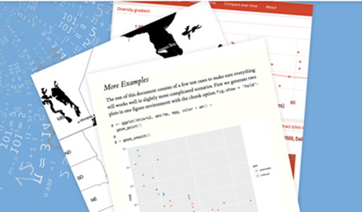

---
output:
  revealjs::revealjs_presentation:
    css: styles.css
    incremental: true
    reveal_options:
      slideNumber: true
      previewLinks: true
---

# Welcome

## R Markdown
### Aaron Williams
#### IBP and Program on Retirement Policy



## Stop, Disclaimer, Warning:


Before starting any public-facing work, please contact:

> - [David Connell](dconnell@urban.org)
> - [John Wehmann](jwehmann@urban.org)

<small>Via [Roulex_45](https://en.wikipedia.org/wiki/Stop_sign#/media/File:Vienna_Convention_road_sign_B2a.svg)</small>

## R Markdown

- Code
- Code Output
- Narrative

## Example

We used a linear model because...

```{r linear model}
model1 <- lm(formula = dist ~ speed, data = cars)
model1
```

An increase in travel speed of one mile per hour is associated with a `r round(model1$coefficients[2], 2)` foot increase in stopping distance. 

## [Abundance of Outputs](http://rmarkdown.rstudio.com/gallery.html) {data-background-iframe="http://rmarkdown.rstudio.com/gallery.html"}

## knitr Language Engines
> - Python
> - SQL
> - Bash
> - Rcpp
> - Stan
> - Javascript 
> - CSS

# Motivation

## Problem #1: Copying-and-Pasting


Copying-and-pasting tables, charts, and numbers is tedious, error-prone, and labor intensive. 

## Problem #1.5: Repetition


Iterating entire documents by geography, time period, or set of assumptions is even more tedious, error-prone, and labor intensive. 

## Problem #2: Out-of-sequence


- Run parts of a script out of order. 
- Change code without changing tables and figures. 

<small>Via [die-seite-des-dr-caligari](http://die-seite-des-dr-caligari.tumblr.com/post/102115497897)</small>

## Problem #3: Parallel Documents


- Lab notebook
- Reports that are more interesting than can be captured by paper

<small>Via [die-seite-des-dr-caligari](http://die-seite-des-dr-caligari.tumblr.com/post/82403756110)</small>

## Problem #4: Is code written for machines or humans?


<small>Via [JoeDaEskimo](https://www.reddit.com/r/HighQualityGifs/comments/1xeb13/gif_remake_ron_swanson_throwing_away_his_computer/)</small>

## Literate (Statistical) Programming

Don Knuth


> <small>Let us change our traditional attitude to the construction of programs: Instead of imagining that our main task is to instruct a computer what to do, let us concentrate rather on explaining to human beings what we want a computer to do. ~Literate Programming (1984) </small>

<small>Via [Jacob Applebaum](https://en.wikipedia.org/wiki/Donald_Knuth#/media/File:KnuthAtOpenContentAlliance.jpg)</small>

# Building a Document

## R markdown


[R for Data Science](https://github.com/hadley/r4ds/blob/master/images/RMarkdownFlow.png) by Hadley Wickham and Garrett Grolemund

## Three Ingredients for R Markdown

- YAML Header
- Markdown Text
- Code Chunks

# YAML Header

## YAML Header

**Y**et **A**nother **M**arkup **L**anguage

Document type and settings

## YAML Header

```{r eval=FALSE}
---
title: "R Markdown"
author: "Aaron Williams"
date: "June 22, 2017"
output: html_document
---  
```

## Options

```{r eval=FALSE}
---
title: "R Markdown"
author: "Aaron Williams"
date: "June 22, 2017"
output: 
  html_document:
    code_folding: hide
    toc: true
    toc_float: TRUE 
---  
```

**NOTE:** Use spaces, not tabs!

[Example](http://urbaninstitute.github.io/urban_R_theme/)

# Markdown

## Shortcut for HTML {#htmlshortcut}

HyperText Markup Language

<div id="left">
```{r eval=FALSE}
<h2>Title</h2>
  
<h3>Subtitle</h3>  
  
<a href="www.rstudio.com">text</a>

<ul>
  <li>Bulleted List</li>
</ul>
```
</div>

<div id="right">
```{r eval=FALSE}
## Title

### Subtitle

[text](www.rstudio.com) 

- Bulleted List
```
</div>

## [Markdown](https://stackedit.io/editor) {data-background-iframe="https://stackedit.io/editor"}

## [Pandoc Markdown](http://rmarkdown.rstudio.com/authoring_pandoc_markdown.html)

## [Pandoc Markdown](http://rmarkdown.rstudio.com/authoring_pandoc_markdown.html)

### TeX Equations

- \$E = mc^2$

$E = mc^2$

- \$y = \\mu + \\sum_{i=1}^p \\beta_ix_i + \\epsilon$

$y = \mu + \sum_{i=1}^p \beta_i x_i + \epsilon$

## [Pandoc Markdown](http://rmarkdown.rstudio.com/authoring_pandoc_markdown.html)

### Bibliography
```{r eval=FALSE}
---
title: "Bibliography Example"
output: html_document
bibliography: bibliography.bib
biblio-style: "apalike"
link-citations: true
---
```

## [Pandoc Markdown](http://rmarkdown.rstudio.com/authoring_pandoc_markdown.html)

### Bibliography

```{r eval=FALSE}
@Xie{R-base,
  title = {Authoring Books with R Markdown},
  author = {{Yihui Xie}},
  organization = {R Studio},
  address = {Nebraska},
  year = {2016},
  url = {https://bookdown.org/yihui/bookdown/citations.html},
}
```

## [Pandoc Markdown](http://rmarkdown.rstudio.com/authoring_pandoc_markdown.html)

### Bibliography

- Blah blah [see @Xie, pp. 33-35].

- Blah Yuihi Xie blah [see -@Xie, pp. 33-35].

[Example](https://github.com/bbest/rmarkdown-example)

# Code Chunks

## Template

```{r codechunk1, eval=FALSE}

\ ```{}
\ ```
```

## Template

```{r codechunk2, eval=FALSE}
\ ```{<language> <codechunk name>}
\ ```
```

- Names should be unique
- Name chunks after what they create
- Names are useful for navigation
- Names are important for caching

## Earlier Example

We used a linear model because...

```{r linear model redux}
model1 <- lm(formula = dist ~ speed, data = cars)
model1
```

An increase in travel speed of one mile per hour is associated with a `r round(model1$coefficients[2], 2)` foot increase in stopping distance. 

## Earlier Example

We used a linear model because...

```{r eval=FALSE}
\```{r linear model}
model1 <- lm(formula = dist ~ speed, data = cars)
model1
\```
```

```{r linear model redux redux, echo=FALSE}
model1 <- lm(formula = dist ~ speed, data = cars)
model1
```

An increase in travel speed of one mile per hour is associated with a `r round(model1$coefficients[2], 2)` foot increase in stopping distance. 

```{r eval=FALSE}
`r round(model1$coefficients[2], 2)`
```

# Demo!

- html_document
- PDF
- [Word](http://rmarkdown.rstudio.com/word_document_format.html)

# Other Types of Output

## html_notebook

[html_notebook](http://rmarkdown.rstudio.com/r_notebooks.html) - Interactive R Notebooks
- Data scientists/researchers lab notebook

## [Websites](https://ui-research.github.io/r-at-urban/index.html) {data-background-iframe="https://ui-research.github.io/r-at-urban/index.html"}

## [html widget](https://beta.rstudioconnect.com/jjallaire/htmlwidgets-highcharter/htmlwidgets-highcharter.html) {data-background-iframe="https://beta.rstudioconnect.com/jjallaire/htmlwidgets-highcharter/htmlwidgets-highcharter.html"}

## [This Presentation!](https://github.com/UI-Research/rmarkdown-brownbag) {data-background-iframe="https://github.com/UI-Research/rmarkdown-brownbag"}

- [ioslides_presentation](http://rmarkdown.rstudio.com/ioslides_presentation_format.html) - HTML presentation with ioslides
- [revealjs::revealjs_presentation]- HTML presentation with reveal.js
- [slidy_presentation](http://rmarkdown.rstudio.com/slidy_presentation_format.html) - HTML presentation with W3C Slidy
- [beamer_presentation](http://rmarkdown.rstudio.com/beamer_presentation_format.html) - PDF presentation with LaTeX Beamer

## Books

[Bookdown](https://bookdown.org/)

## More!

- [websites](http://rmarkdown.rstudio.com/rmarkdown_websites.html) - Complete websites
- [flexdashboard::flex_dashboard](http://rmarkdown.rstudio.com/flexdashboard/) - Interactive dashboards
- [tufte::tufte_html](http://rmarkdown.rstudio.com/tufte_handout_format.html) - HTML handouts in the style of Edward Tufte

# Parameters

```{r eval=FALSE}
---
title: "Parameters"
output: html_document
params:
	data: ""
---
	
params$data
```

## Iterate

```{r eval=FALSE}
library(fivethirtyeight)
library(stringr)

# Create vector of state names
state <- bad_drivers$state

#Create data frame with parameters
reports <- tibble(
	filename = str_c("driving-", state, ".html"),
	params = map(state, ~list(state = .))
)

# Iterate across parameters and knit documents for 51 states
reports %>%
	select(output_file = filename, params) %>%
	pwalk(rmarkdown::render, input = "demonstration.Rmd")
```

# Closing

## R Markdown vs. LaTeX


R Markdown and LaTeX are compliments, not substitutes. 

- R Markdown is way easier than LaTeX
- R Markdown creates more output types than LaTeX
- LaTeX has more control and is better for documents with page breaks

<small>Via [Thenub314](https://en.wikibooks.org/wiki/LaTeX#/media/File:LaTeX_cover.svg)</small>

## More Resources

>- [R for Data Science](http://r4ds.had.co.nz/r-markdown.html)
>- [R Studio](http://rmarkdown.rstudio.com/)
>- [R Studio Gallery](http://rmarkdown.rstudio.com/gallery.html)
>- [Email Me!](awilliams@urban.org)

## Questions and Comments?