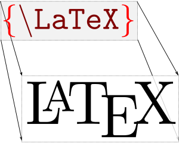

## Stop, Disclaimer, Warning:


Before starting any public-facing work, please contact:

> - [David Connell](dconnell@urban.org)
> - [John Wehmann](jwehmann@urban.org)

https://en.wikipedia.org/wiki/Stop_sign#/media/File:Vienna_Convention_road_sign_B2a.svg

# Motivation

## R Markdown

- Code
- Code Output
- Narrative

## R Markdown

We used a linear model because...

```{r linear model}
model1 <- lm(formula = dist ~ speed, data = cars)
model1
```

An increase in travel speed of one mile per hour is associated with a `r round(model1$coefficients[2], 2)` foot increase in stopping distance. 

-r round(model1$coefficients[2]

## knitr Language Engines
> - Python
> - SQL
> - Bash
> - Rcpp
> - Stan
> - Javascript 
> - CSS

## Problem #1: Copying-and-Pasting

### Copy-and-Paste Cat


Copying-and-pasting tables, charts, and numbers is tedious, error-prone, and labor intensive. 

## Problem #2: Out-of-sequence

Run a late part of your analysis without running an earlier part. 

labor-intensive workflows 

## Problem #3: Parallel Documents

I ran this regression because. 
We dropped these missing values because. 

## Problem #4: Repetition

Iterate the entire report by geography, time period, or set of assumptions. 


## [Abundance of Outputs](http://rmarkdown.rstudio.com/gallery.html) {data-background-iframe="http://rmarkdown.rstudio.com/gallery.html"}

## R Markdown vs. LaTeX



- R Markdown creates more output types
- R Markdown is way easier
- LaTeX is better for documents with difficult page breaks 

https://en.wikibooks.org/wiki/LaTeX#/media/File:LaTeX_cover.svg
Thenub314

# Building a Document

## R markdown


https://github.com/hadley/r4ds/blob/master/images/RMarkdownFlow.png

## Three Ingredients for R Markdown

- YAML Header
- Markdown
- Code Chunks

# YAML Header

Yet Another Markup Language

Document type and settings

## YAML Header

```{r eval=FALSE}
---
title: "R Markdown"
author: "Aaron Williams"
date: "June 22, 2017"
output: 
  html_document:
    options:     
      code_folding: hide
      toc: true
      toc_float: TRUE 
---  
```

# Markdown

## Shortcut for HTML {#htmlshortcut}

<div id="left">
```{r eval=FALSE}
<h2>Title</h2>
  
<h3>Subtitle</h3>  
  
<a href="www.rstudio.com">text</a>

<ul>
  <li>Bulleted List</li>
</ul>
```
</div>

<div id="right">
```{r eval=FALSE}
## Title

### Subtitle

[text](www.rstudio.com) 

- Bulleted List
```
</div>

## [Markdown](https://stackedit.io/editor) {data-background-iframe="https://stackedit.io/editor"}

## Pandoc Markdown

LaTeX Equations
Bibliography

# Demo!

# Types of Output
Documents:
- [html_notebook](http://rmarkdown.rstudio.com/r_notebooks.html) - Interactive R Notebooks
- [html_document](http://rmarkdown.rstudio.com/html_document_format.html) - HTML document w/ Bootstrap CSS
- [pdf_document](http://rmarkdown.rstudio.com/pdf_document_format.html) - PDF document (via LaTeX template)
- [word_document](http://rmarkdown.rstudio.com/word_document_format.html) - Microsoft Word document (docx)

Presentations (slides):
- [ioslides_presentation](http://rmarkdown.rstudio.com/ioslides_presentation_format.html) - HTML presentation with ioslides
- [revealjs::revealjs_presentation](http://rmarkdown.rstudio.com/revealjs_presentation_format.html) - HTML presentation with reveal.js
- [slidy_presentation](http://rmarkdown.rstudio.com/slidy_presentation_format.html) - HTML presentation with W3C Slidy
- [beamer_presentation](http://rmarkdown.rstudio.com/beamer_presentation_format.html) - PDF presentation with LaTeX Beamer

More:
- [flexdashboard::flex_dashboard](http://rmarkdown.rstudio.com/flexdashboard/) - Interactive dashboards
- [tufte::tufte_html](http://rmarkdown.rstudio.com/tufte_handout_format.html) - HTML handouts in the style of Edward Tufte
- [bookdown](https://bookdown.org/)

# Use Cases


